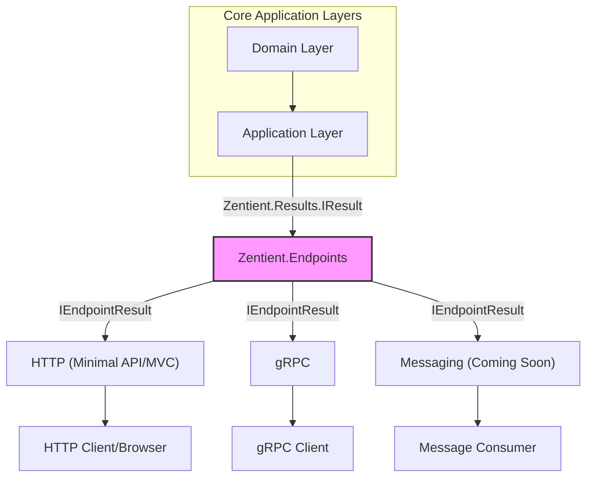

# Zentient.Endpoints — Unified, Transport-Agnostic Result Handling for .NET

[](https://www.nuget.org/packages/Zentient.Endpoints)
[](https://www.nuget.org/packages/Zentient.Endpoints.Http)
[](https://github.com/ulfbou/Zentient.Endpoints/actions)


---

## Table of Contents

- [Overview](#-overview)
- [Why Zentient.Endpoints?](#-why-zentientendpoints)
- [Architecture](#-architecture-overview)
- [Quick Start](#-quick-start)
- [Advanced Usage](#-advanced-usage)
- [Observability](#-observability)
- [Vision & Roadmap](#-vision--roadmap)
- [Contributing](#-contributing)

---

## 🚀 Overview

**Zentient.Endpoints** is a modular, protocol-agnostic result adapter for .NET services. It bridges your clean, transport-neutral application logic—using [`Zentient.Results`](https://www.nuget.org/packages/Zentient.Results)—with HTTP, gRPC, and messaging transports.

_No more boilerplate status code mapping. No more brittle exception filters. Just structured, consistent, observable outcomes, every time._

---

## ❓ Why Zentient.Endpoints?

When building modern .NET APIs, the transport layer (HTTP, gRPC, MQ) often leaks into your core logic through:

- 🔁 Repeated error-to-response mapping
- ⚠️ Inconsistent error formats across transports
- 🙈 Opaque try-catch blocks for edge case handling
- 🔍 Weak observability with missing context

Zentient.Endpoints introduces a single, consistent boundary abstraction:

```
IResult<T> (from Zentient.Results) → IEndpointResult<T> → Transport-specific response
```

### ✨ Key Differentiators

- 🚛 **Protocol-Agnostic Outcome Flow**  
  Return `IResult<T>` from your application logic, and adapt it to HTTP, gRPC, or Messaging with zero knowledge of the transport in your service layer.

- 🧱 **Clean Architecture Compliant**  
  `EndpointResult<T>` lives at the Presentation layer and cleanly wraps domain results. No controller, service, or mapper duplication.

- 📦 **Modular & Extensible**  
  - Zentient.Endpoints.Http for ASP.NET Core  
  - Zentient.Endpoints.Grpc for gRPC  
  - Custom transports coming soon (Messaging, SignalR)

- 🛡️ **Exception Resilience**  
  Automatically captures exceptions in bind chains and turns them into structured `ErrorInfo`.

- 🔍 **Structured Observability**  
  Transport metadata + rich ErrorInfo = deeply traceable logs and spans.

---

## 🏛️ Architecture Overview

Zentient.Endpoints serves as the unified boundary adapter:



---

## 💻 Quick Start

**1. Install NuGet Packages**

```bash
dotnet add package Zentient.Endpoints
dotnet add package Zentient.Endpoints.Http
```

**2. Configure Services in Program.cs**

```csharp
builder.Services.AddProblemDetails();
builder.Services.AddZentientEndpointsHttp(); // Adds NormalizeEndpointResultFilter
```

**3. Use EndpointResult<T> in Minimal API**

```csharp
app.UseEndpointFilter<NormalizeEndpointResultFilter>();

app.MapPost("/api/users", async (CreateUserRequest request, IUserService userService) =>
{
    var result = await userService.CreateUser(request);
    return EndpointResult<User>.From(result); // auto-normalized to Results.Ok/BadRequest/etc
})
.Produces<UserResponse>(201)
.ProducesProblem(400)
.ProducesProblem(500);
```

**4. Return IResult<T> from Application Layer**

```csharp
public class UserService : IUserService
{
    public async Task<IResult<User>> CreateUser(CreateUserRequest req)
    {
        if (string.IsNullOrWhiteSpace(req.Name))
            return Result<User>.Failure(ErrorInfo.BadRequest("EmptyName", "Name is required"));

        return Result<User>.Success(new User(Guid.NewGuid(), req.Name));
    }
}
```

---

## 🔧 Advanced Usage

### 🛠 Custom IProblemDetailsMapper

Customize HTTP ProblemDetails output:

```csharp
public class MyProblemDetailsMapper : IProblemDetailsMapper
{
    public ProblemDetails Map(ErrorInfo error, HttpContext ctx)
    {
        var pd = new ProblemDetails
        {
            Status = error.Category.ToHttpStatusCode(),
            Type = $"https://errors.myapi.com/{error.Code}",
            Title = error.Message,
            Detail = error.Detail,
            Instance = ctx.Request.Path
        };
        pd.Extensions["requestId"] = ctx.TraceIdentifier;
        pd.Extensions["errorCode"] = error.Code;
        return pd;
    }
}
```

**Register:**

```csharp
builder.Services.AddScoped<IProblemDetailsMapper, MyProblemDetailsMapper>();
```

### 🔐 Exception-Safe Binding

`EndpointResult<T>` includes a `.Bind(...)` method that gracefully handles exceptions:

```csharp
return EndpointResult<User>
    .From(serviceResult)
    .Bind(user => user.IsActive ? Result.Success(user) : throw new InvalidOperationException());
```

Exceptions are captured and wrapped as structured `ErrorInfo.Internal`.

---

## 📡 gRPC Support

With Zentient.Endpoints.Grpc:

```csharp
public override Task<UserResponse> GetUser(UserRequest req, ServerCallContext ctx)
{
    var result = await _service.GetUser(req.Id);
    return result
        .ToEndpointResult()
        .ToRpcResult(mapper: MyGrpcMapper); // Handles RpcException, metadata
}
```

Automatically maps errors to gRPC trailers with rich metadata.

---

## 📊 Observability

- **Structured Logging:**  
  Every ErrorInfo has Category, Code, Message, and Data, ready for Serilog/Elastic/OpenSearch indexing.

- **OpenTelemetry Tracing:**  
  Easily attach transport + result metadata to spans.

---

## 🗺️ Vision & Roadmap

Zentient.Endpoints aims to become the standard outcome adapter for multi-transport .NET systems.

**Planned:**
- ✅ HTTP & gRPC support
- 🔄 RabbitMQ / Kafka (Messaging)
- 📡 SignalR/WebSocket support
- 🧰 Code generators for SDKs
- 🛠 Better ProblemDetails extension helpers

---

## 🤝 Contributing

We welcome contributions from experienced .NET developers who care about clean, scalable service boundaries.

- Open an issue
- Join discussions
- Submit a PR with tests and motivation

> Zentient.Endpoints is built for those who believe the boundary between core and edge should be elegant, not repetitive.

---

> Created with ❤️ by [@ulfbou](https://github.com/ulfbou) and the Zentient contributors.
