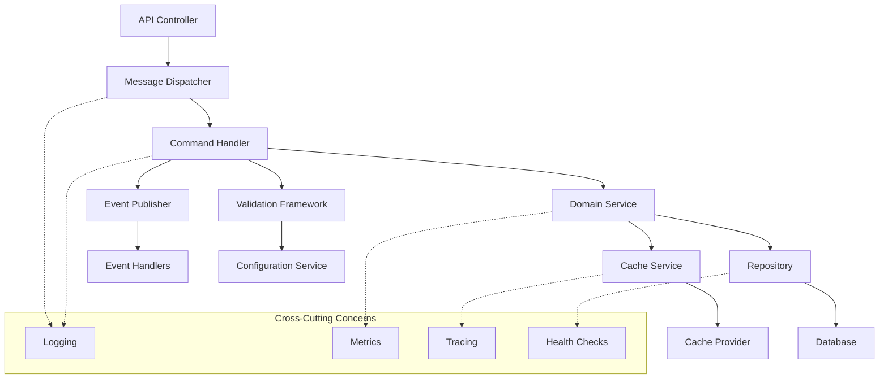

# 🏗️ Architecture Documentation

## Overview

Zentient.Abstractions provides a comprehensive architectural foundation for building enterprise-grade applications with clear separation of concerns, robust error handling, and rich observability. This section covers the detailed architecture of each major system component.

## 📋 Architecture Components

### **Core Systems**

| Component | Description | Key Features |
|-----------|-------------|--------------|
| **[Dependency Injection](dependency-injection.md)** | Advanced DI system with fluent APIs and automatic discovery | Service definitions, automatic registration, decoration patterns, validation |
| **[CQRS & Messaging](cqrs-messaging.md)** | Command/Query separation with rich messaging infrastructure | Type-safe handlers, automatic routing, event-driven architecture, sagas |
| **[Validation Framework](validation-framework.md)** | Comprehensive validation with contextual rules | Declarative rules, fluent validation, contextual scenarios, pipeline integration |
| **[Caching System](caching-system.md)** | Sophisticated caching with type safety and automatic invalidation | Cache definitions, multi-level caching, distributed support, event-driven invalidation |
| **[Configuration Management](configuration-management.md)** | Strongly-typed configuration with hierarchical scoping | Type-safe configurations, dynamic updates, encryption, compliance auditing |

## 🎯 Architectural Principles

### **1. Definition-Centric Architecture**

Everything in Zentient is defined as a first-class architectural component with rich metadata:

```csharp
// Services have rich definitions
[ServiceDefinition("UserManagement", Version = "3.1.0")]
public record UserServiceDefinition : IServiceDefinition
{
    public IMetadata Metadata => new MetadataCollection
    {
        ["Domain"] = "Identity",
        ["Layer"] = "Application",
        ["Dependencies"] = new[] { "IUserRepository", "IEmailService" },
        ["Capabilities"] = new[] { "UserRegistration", "Authentication" }
    };
}

// Commands have architectural context
[CommandDefinition("UserManagement.CreateUser", Version = "2.1.0")]
public record CreateUserCommand : ICommand<CreateUserCommand, UserCode, UserError>
{
    public IMetadata Metadata => new MetadataCollection
    {
        ["BusinessProcess"] = "UserOnboarding",
        ["RequiredPermissions"] = new[] { "Users.Create" },
        ["AuditLevel"] = "High"
    };
}

// Configurations are architectural components
[ConfigurationDefinition("Database", Version = "2.1.0")]
public record DatabaseConfiguration : IConfigurationDefinition<DatabaseConfiguration>
{
    public IMetadata Metadata => new MetadataCollection
    {
        ["SensitivityLevel"] = "High",
        ["ChangeNotification"] = "Required",
        ["EncryptionRequired"] = true
    };
}
```

### **2. Universal Envelope Pattern**

All operations return consistent envelope responses with rich error context:

```csharp
// Service operations
public async Task<IEnvelope<UserDto, UserCode, UserError>> GetUser(string id)
{
    var result = await _repository.GetById(id);
    
    return result.IsSuccess
        ? Envelope.Success(UserCode.Retrieved, result.Value)
        : Envelope.NotFound<UserDto, UserCode, UserError>(
            UserError.UserNotFound(id));
}

// Command handlers
public async Task<IEnvelope<UserCode, UserError>> Handle(
    CreateUserCommand command,
    CancellationToken cancellationToken = default)
{
    try
    {
        // Business logic...
        return Envelope.Success(UserCode.Created);
    }
    catch (ValidationException ex)
    {
        return Envelope.ValidationError<UserCode, UserError>(
            UserError.ValidationFailed(ex.Errors));
    }
}

// Cache operations
public async Task<IEnvelope<UserDto, CacheCode, CacheError>> GetUser(string id)
{
    var result = await _cache.Get(id);
    
    return result.IsSuccess
        ? Envelope.Success(CacheCode.Hit, result.Value)
        : Envelope.NotFound<UserDto, CacheCode, CacheError>(
            CacheError.KeyNotFound(id));
}
```

### **3. Fluent Dependency Injection**

Rich, discoverable APIs for service registration and configuration:

```csharp
services.AddZentientServices(builder =>
{
    builder
        .ScanAssembly(typeof(UserService).Assembly)
        .RegisterServicesWithAttribute<ServiceRegistrationAttribute>()
        .RegisterValidatorsWithInterface<IValidator>()
        
        // Cross-cutting concerns
        .AddValidation()
        .AddCaching(TimeSpan.FromMinutes(30))
        .AddRetryPolicy(maxAttempts: 3)
        .AddCircuitBreaker(failureThreshold: 5)
        .AddLogging(LogLevel.Information)
        .AddMetrics()
        .AddHealthChecks();
});
```

### **4. Built-in Observability**

Comprehensive observability at every layer with structured logging, metrics, and tracing:

```csharp
public async Task<IEnvelope<UserCode, UserError>> ProcessUserRegistration(
    CreateUserCommand command)
{
    using var activity = Activity.StartActivity("ProcessUserRegistration");
    activity?.SetTag("user.email", command.Email);
    
    _logger.LogInformation("Processing user registration for {Email}", command.Email);
    
    try
    {
        // Process registration...
        
        _metrics.IncrementCounter("user.registration.success", new()
        {
            ["source"] = "web",
            ["user_type"] = "standard"
        });
        
        return Envelope.Success(UserCode.Created);
    }
    catch (Exception ex)
    {
        _logger.LogError(ex, "Error processing user registration for {Email}", command.Email);
        
        _metrics.IncrementCounter("user.registration.error", new()
        {
            ["error_type"] = ex.GetType().Name,
            ["source"] = "web"
        });
        
        throw;
    }
}
```

## 🔄 Component Interactions

### **Cross-Component Integration**

Components work together seamlessly through well-defined interfaces:



### **Data Flow Example**

Here's how a typical user creation request flows through the architecture:

1. **API Request** → Controller receives `CreateUserCommand`
2. **Dispatch** → `IMessageDispatcher` routes to appropriate handler
3. **Validation** → `ValidationBehavior` validates command using registered validators
4. **Handler Execution** → `CreateUserCommandHandler` executes business logic
5. **Repository** → `IUserRepository` persists user data
6. **Caching** → `ICacheService` caches user data for performance
7. **Events** → `UserCreatedEvent` published for downstream processing
8. **Response** → Envelope with success/error information returned

```csharp
[HttpPost]
public async Task<IActionResult> CreateUser([FromBody] CreateUserCommand command)
{
    // 1. API Request received
    var result = await _dispatcher.Dispatch(command);
    
    // 8. Response returned as ActionResult
    return result.ToActionResult();
}

// 2. Message dispatcher routes to handler
// 3. Validation pipeline runs automatically
// 4. Handler executes
public async Task<IEnvelope<UserCode, UserError>> Handle(CreateUserCommand command)
{
    // 5. Repository persistence
    var createResult = await _repository.Create(user);
    
    // 6. Cache update
    await _cache.SetUser(user.Id, userDto);
    
    // 7. Event publishing
    await _eventPublisher.Publish(new UserCreatedEvent { ... });
    
    return Envelope.Success(UserCode.Created);
}
```

## 🎨 Extension Points

### **Custom Implementations**

The architecture provides multiple extension points for customization:

```csharp
// Custom cache provider
public class CustomCacheProvider : ICacheProvider
{
    public async Task<IEnvelope<T, CacheCode, CacheError>> Get<T>(string key)
    {
        // Custom caching logic
    }
}

// Custom validation rule
public class CustomBusinessRuleValidator : IValidator<CreateOrderCommand, OrderCode, OrderError>
{
    public async Task<IValidationResult<OrderCode, OrderError>> Validate(
        CreateOrderCommand command,
        ValidationContext context,
        CancellationToken cancellationToken)
    {
        // Custom validation logic
    }
}

// Custom message behavior
public class CustomBehavior<TRequest, TResponse> : IPipelineBehavior<TRequest, TResponse>
{
    public async Task<TResponse> Handle(
        TRequest request,
        RequestHandlerDelegate<TResponse> next,
        CancellationToken cancellationToken)
    {
        // Custom cross-cutting logic
        return await next();
    }
}
```

### **Integration Patterns**

Common patterns for integrating with external systems:

```csharp
// External service integration
[ServiceRegistration(ServiceLifetime.Scoped)]
public class ExternalPaymentService : IPaymentService
{
    private readonly HttpClient _httpClient;
    private readonly IConfigurationService<PaymentConfiguration> _config;
    private readonly ICache<PaymentResponseDto> _cache;
    
    public async Task<IEnvelope<PaymentCode, PaymentError>> ProcessPayment(
        PaymentRequest request)
    {
        // Circuit breaker, retry, caching, etc.
        return await _httpClient.PostAsJson(endpoint, request)
            .ContinueWith(HandleResponse);
    }
}

// Database integration
[ServiceRegistration(ServiceLifetime.Scoped)]
public class SqlUserRepository : IUserRepository
{
    private readonly IDbContext _context;
    private readonly IMapper _mapper;
    private readonly ICache<UserDto> _cache;
    
    public async Task<IEnvelope<UserDto, RepositoryCode, RepositoryError>> GetById(string id)
    {
        // Try cache first, fallback to database
        var cached = await _cache.Get(id);
        if (cached.IsSuccess) return cached;
        
        var entity = await _context.Users.Find(id);
        // Map, cache, return...
    }
}
```

## 📊 Performance Considerations

### **Optimization Strategies**

The architecture includes several built-in performance optimizations:

1. **Caching Layers** - Multi-level caching with automatic invalidation
2. **Async/Await** - Non-blocking operations throughout
3. **Pooling** - Object pooling for expensive resources
4. **Batching** - Batch operations where applicable
5. **Lazy Loading** - Deferred service resolution
6. **Circuit Breakers** - Prevent cascade failures

### **Monitoring & Diagnostics**

Built-in monitoring provides insights into system performance:

```csharp
// Performance metrics automatically collected
_metrics.RecordDuration("operation.duration", duration, new()
{
    ["operation"] = "CreateUser",
    ["status"] = "success"
});

// Health checks for system components
services.AddHealthChecks()
    .AddCheck<DatabaseHealthCheck>("database")
    .AddCheck<CacheHealthCheck>("cache")
    .AddCheck<ExternalServiceHealthCheck>("external-services");

// Distributed tracing for request correlation
using var activity = Activity.StartActivity("ProcessOrder");
activity?.SetTag("order.id", orderId);
activity?.SetTag("customer.id", customerId);
```

---

**This architecture provides a solid foundation for building scalable, maintainable enterprise applications with comprehensive error handling, observability, and extensibility.**
