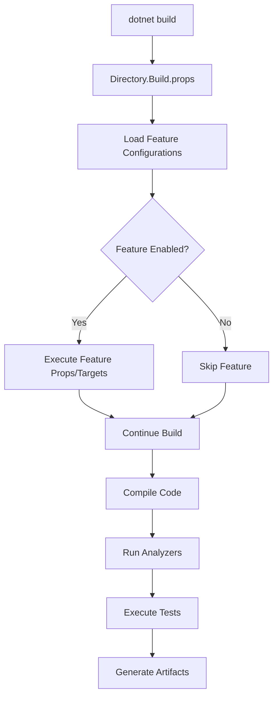
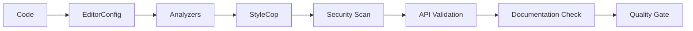
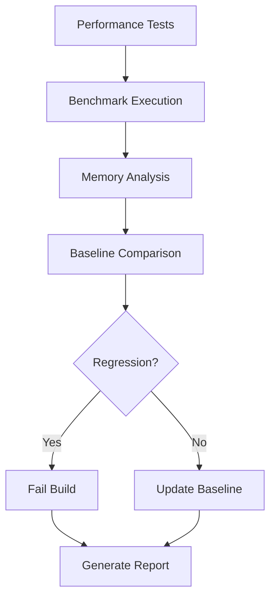
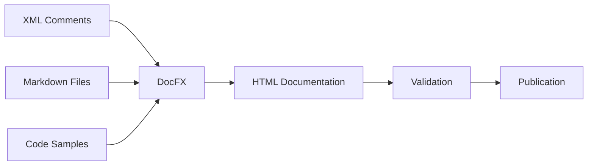

# Architecture Overview

This document describes the architecture and design principles of the Zentient Library Template.

## Design Principles

### 1. **Separation of Concerns**
Each Directory.*.* file handles a specific aspect of the build process:
- **Directory.Build.*** - Core build configuration
- **Directory.Pack.*** - NuGet packaging
- **Directory.Sign.*** - Code signing and strong naming
- **Directory.Test.*** - Testing infrastructure
- **Directory.Quality.*** - Code quality and analysis
- **Directory.Security.*** - Security scanning and validation
- **Directory.Documentation.*** - Documentation generation
- **Directory.Performance.*** - Performance monitoring

### 2. **Convention over Configuration**
The template follows established .NET conventions:
- Standard project structure (src/, tests/, docs/)
- MSBuild property and target naming
- NuGet package metadata standards
- .NET analyzer integration patterns

### 3. **Progressive Enhancement**
Features can be enabled/disabled through template parameters:
- Essential features enabled by default
- Advanced features (performance, security) opt-in
- Graceful degradation when tools aren't available

### 4. **Enterprise-Ready**
Built for production use with:
- Comprehensive automation
- Quality gates and validation
- Security compliance
- Audit trails and reporting

## Build System Architecture

### Core Build Flow



### Feature Integration

Each feature follows a consistent pattern:

1. **Props File** - Configuration and properties
2. **Targets File** - Build tasks and automation
3. **Conditional Import** - Only loaded when enabled
4. **Graceful Fallback** - Works even if tools aren't installed

## Code Organization

### Library Structure

```
src/
├── YourLibrary.csproj          # Main project
├── GlobalUsings.cs             # Shared using statements
├── ExampleService.cs           # Example implementation
├── Interfaces/                 # Interface definitions
├── Models/                     # Data models
├── Services/                   # Business logic
└── Extensions/                 # Extension methods
```

### Test Structure

```
tests/
├── YourLibrary.Tests.csproj    # Test project
├── GlobalUsings.cs             # Test using statements
├── ExampleServiceTests.cs      # Unit tests
├── Integration/                # Integration tests
├── Performance/                # Performance tests
└── TestData/                   # Test data files
```

## Zentient Integration

### Core Abstractions

The template integrates with Zentient.Abstractions:

```csharp
// Entity identification
public class MyService : IIdentifiable
{
    public string Id { get; } = Guid.NewGuid().ToString();
}

// Result handling
public IResult<string> ProcessData(string input)
{
    if (string.IsNullOrEmpty(input))
        return Results.Error<string>("Input cannot be empty");
        
    return Results.Success(input.ToUpper());
}

// Configuration
public class MyOptions : IHasName, IHasDescription
{
    public string Name { get; init; } = "MyService";
    public string Description { get; init; } = "Example service";
}
```

### Extension Points

The template provides extension points for:
- Custom analyzers
- Additional build targets
- Custom documentation generation
- Performance benchmarks
- Security validators

## Quality Assurance

### Code Quality Pipeline



### Testing Strategy

1. **Unit Tests** - Individual component testing
2. **Integration Tests** - Component interaction testing
3. **Performance Tests** - Benchmark validation
4. **Security Tests** - Vulnerability assessment
5. **API Tests** - Public interface validation

## Security Architecture

### Security Layers

1. **Dependency Scanning** - NuGet package vulnerability detection
2. **Code Analysis** - Static security analysis
3. **Cryptographic Validation** - Algorithm and key strength validation
4. **Input Validation** - Data sanitization and validation
5. **Assembly Signing** - Code integrity verification

### Compliance

The template supports compliance with:
- OWASP security standards
- Microsoft security guidelines
- Enterprise security policies
- Industry best practices

## Performance Monitoring

### Monitoring Strategy



### Metrics Tracked

- Execution time
- Memory allocation
- GC behavior
- Throughput
- Resource utilization

## Documentation System

### Documentation Types

1. **API Documentation** - XML comments → DocFX
2. **Conceptual Documentation** - Markdown files
3. **Code Samples** - Executable examples
4. **Architecture Documentation** - Design decisions
5. **User Guides** - Getting started and tutorials

### Generation Pipeline



## Extensibility

### Adding Custom Features

1. Create `Directory.CustomFeature.props` for configuration
2. Create `Directory.CustomFeature.targets` for automation
3. Add conditional import to `Directory.Build.props`
4. Add template parameter for feature toggle
5. Update documentation

### Custom Analyzers

```xml
<ItemGroup Condition="'$(EnableCustomAnalysis)' == 'true'">
  <PackageReference Include="YourCustomAnalyzer" Version="1.0.0">
    <PrivateAssets>all</PrivateAssets>
    <IncludeAssets>runtime; build; native; contentfiles; analyzers</IncludeAssets>
  </PackageReference>
</ItemGroup>
```

## Deployment Strategy

### Package Distribution

1. **Development** - Local package feed
2. **CI/CD** - Automated package creation
3. **Staging** - Pre-release packages
4. **Production** - Official NuGet.org publication

### Versioning Strategy

- Semantic versioning (SemVer)
- Automatic version increment
- Pre-release suffixes for development
- Git commit integration

## Maintenance

### Template Updates

1. Update core Zentient.Abstractions reference
2. Update analyzer package versions
3. Refresh Directory.*.* configurations
4. Test with latest .NET versions
5. Update documentation

### Best Practices

- Regular dependency updates
- Security vulnerability monitoring
- Performance regression testing
- Documentation maintenance
- Community feedback integration

This architecture ensures the template remains maintainable, extensible, and production-ready while providing a rich development experience for Zentient ecosystem libraries.
